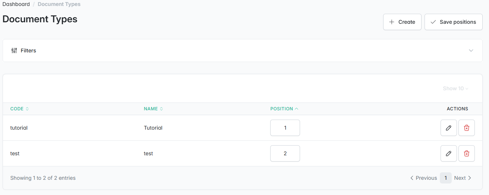
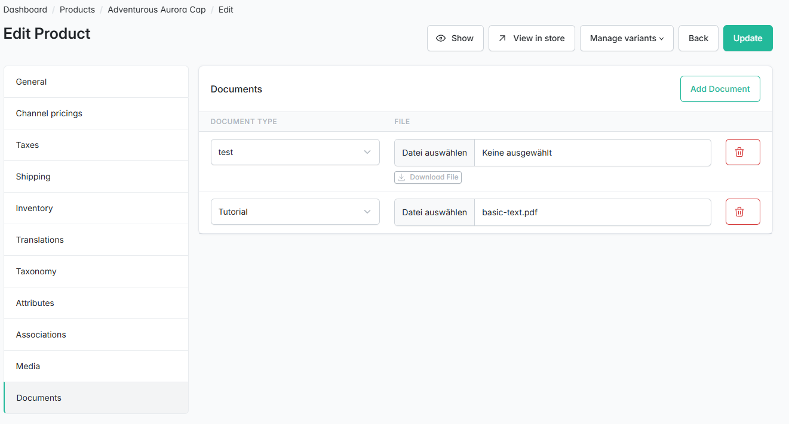
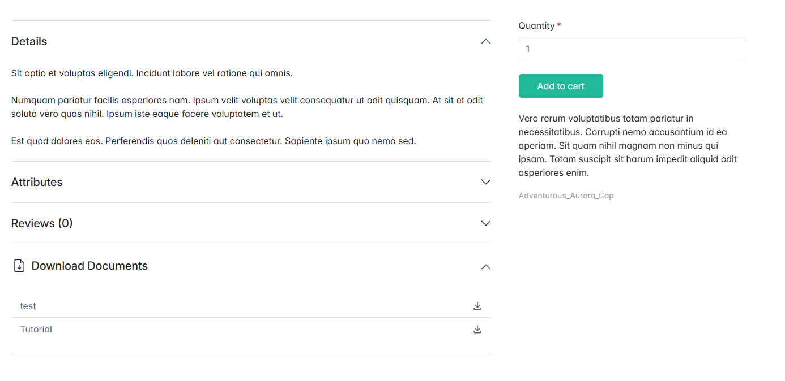

# Sylius Product Document Plugin

[](https://github.com/bitExpert/sylius-product-document-plugin/actions/workflows/build.yaml)
[](https://packagist.org/packages/bitexpert/sylius-product-document-plugin/)
[](https://rheinneckar.social/@bitexpert)

The **Product Document** Plugin for *Sylius* allows you to attach documents (e.g. PDFs, images) to products and organize them by configurable document types.

### Create document types in the admin:



### Attach documents to a product:



### Download the Documents in the storefront:



## Features

* Manage document types with translatable names and sortable positions
* Attach multiple documents to a product, organized by document type
* Download documents in the storefront and in the admin
* Control document visibility: public for all visitors or restricted to logged-in customers

## Requirements

* PHP 8.4 or higher
* Sylius 2.0 or higher

## Installation

1. Install the plugin via Composer

```bash
composer require bitexpert/sylius-product-document-plugin
```

2. Enable the plugin

```php
<?php
# config/bundles.php
return [
    // ...

    BitExpert\SyliusProductDocumentPlugin\BitExpertSyliusProductDocumentPlugin::class => ['all' => true],
];
```

3. Import config

```yaml
# config/packages/_sylius.yaml
imports:
    # ...

    - { resource: "@BitExpertSyliusProductDocumentPlugin/config/config.yaml" }
```

4. Import routing

```yaml
# config/routes/bitexpert_product_document.yaml
bitexpert_product_document_admin:
    resource: "@BitExpertSyliusProductDocumentPlugin/config/routes/admin.yaml"
```

5. Configure the `Product` entity in `src/Entity/Product/Product.php`

Add the `BitExpert\SyliusProductDocumentPlugin\Model\HasProductDocumentsInterface` interface and the `BitExpert\SyliusProductDocumentPlugin\Entity\Trait\HasProductDocumentsTrait` trait to the entity.

```php
<?php

declare(strict_types=1);

namespace App\Entity\Product;

use BitExpert\SyliusProductDocumentPlugin\Entity\Trait\HasProductDocumentsTrait;
use BitExpert\SyliusProductDocumentPlugin\Model\HasProductDocumentsInterface;
use Doctrine\ORM\Mapping as ORM;
use Sylius\Component\Core\Model\Product as BaseProduct;

#[ORM\Entity]
#[ORM\Table(name: 'sylius_product')]
class Product extends BaseProduct implements HasProductDocumentsInterface
{
    use HasProductDocumentsTrait;

    public function __construct()
    {
        parent::__construct();
        $this->initializeProductDocumentsCollection();
    }
}
```

6. Update your database schema

```bash
php bin/console doctrine:migrations:diff
php bin/console doctrine:migrations:migrate
```

## Tests

You can run the unit tests with the following command (requires dependency installation):

```bash
./vendor/bin/phpunit
```

## Contribution

Feel free to contribute to this module by reporting issues or creating pull requests for improvements.

To run the Test Application included in the repo, refer to the [Sylius Test Application](https://docs.sylius.com/plugins-development-guide/test-application) docs.
If you are using [DDEV](https://www.ddev.com) you can run the following commands to bootstrap the Test Application in Docker:

```bash
ddev start
```

```bash
ddev bootstrap
```

## Credits

This plugin was inspired by the [AsdoriaSyliusProductDocumentPlugin](https://github.com/asdoria/AsdoriaSyliusProductDocumentPlugin) by Asdoria and has been rebuilt from scratch for Sylius 2.

## License

The **Sylius Product Document** Plugin for *Sylius* is released under the MIT license.
